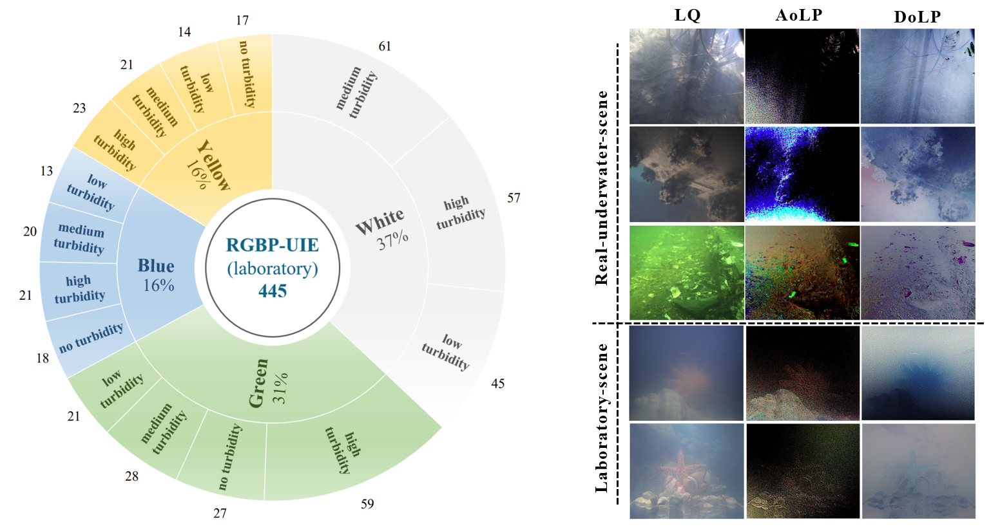

# RGBP-UIE
The first RGB-P multimodal dataset to facilitate supervised learning for underwater image enhancement tasks. The RGBP-UIE dataset comprises 445 laboratory scenarios featuring diverse turbidity and color casts, demonstrating the diversity of the data. Moreover, 200 real scenarios are collected from offshore areas and freshwater lakes based on different water quality and composition. 
  
The dataset is collected using a polarization camera (LUCID, TRI050S),uipped with four directional linear-polarization directions (i.e., 0◦, 45◦, 90◦, and 135◦) at a resolution of 1024×1224. The RGBP-UIE(laboratory) datasets to replicate underwater phenomena like light absorption and scatter, we introduce inks of various colors (i.e., green, blue, and yellow) and concentrated milk (i.e., 5-10ml) into clear water to obtain diverse low-quality RGB and polarization modalities. The RGBP-UIE（real-world） datasets are collected at various underwater depths near the shore and in freshwater lakes.As shown in the figure below.
 
 
 
# Data Access
For inquiries regarding dataset usage and licensing, please contact:
📧 ​​liyudong@dlmu.edu.cn
